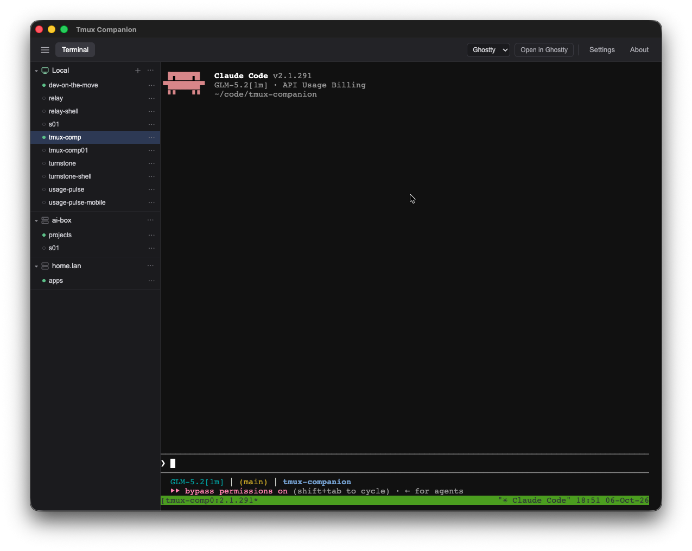
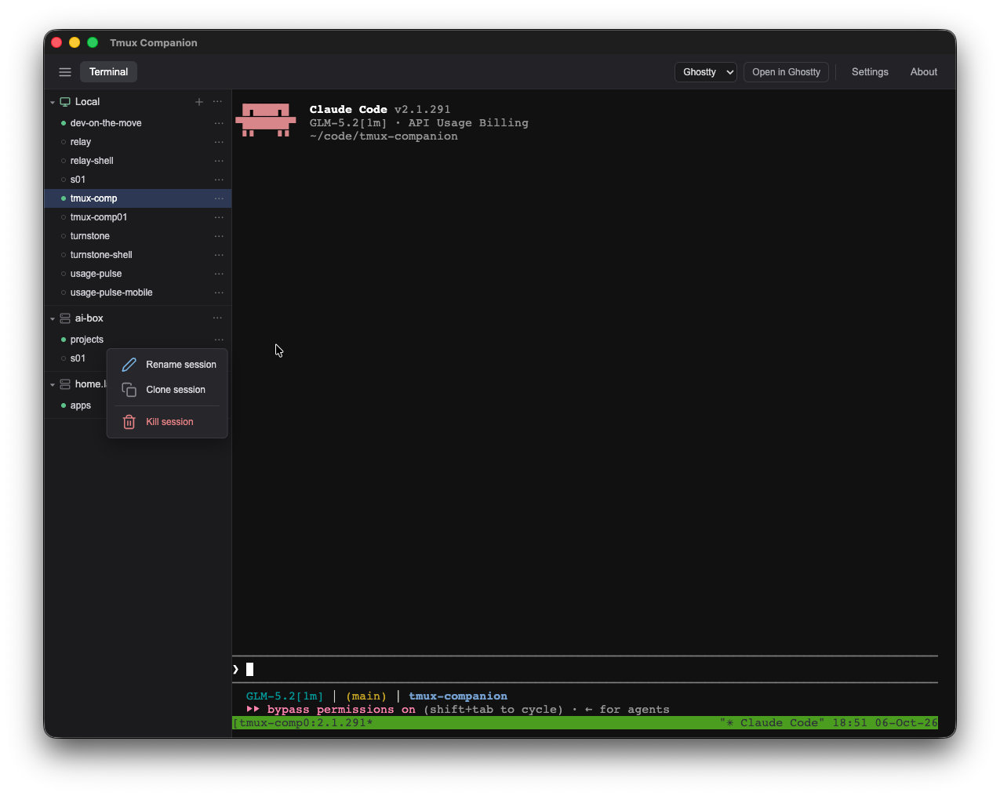
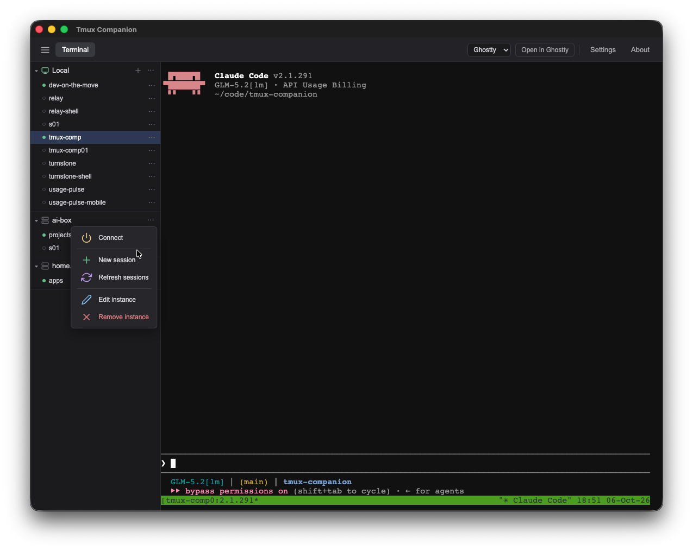
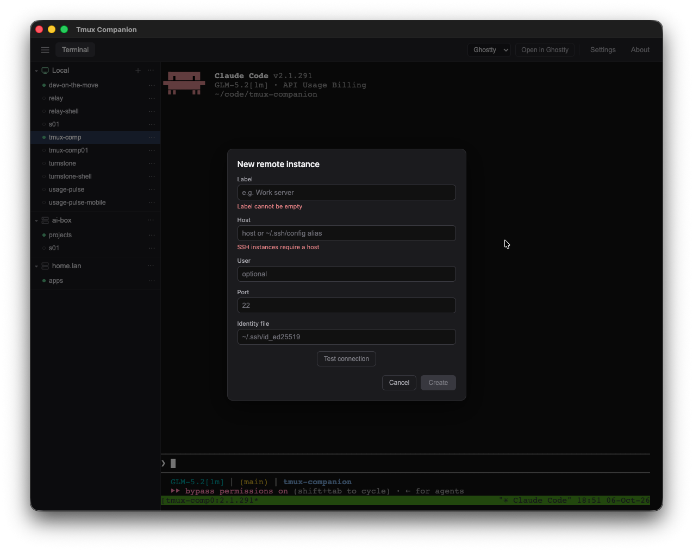
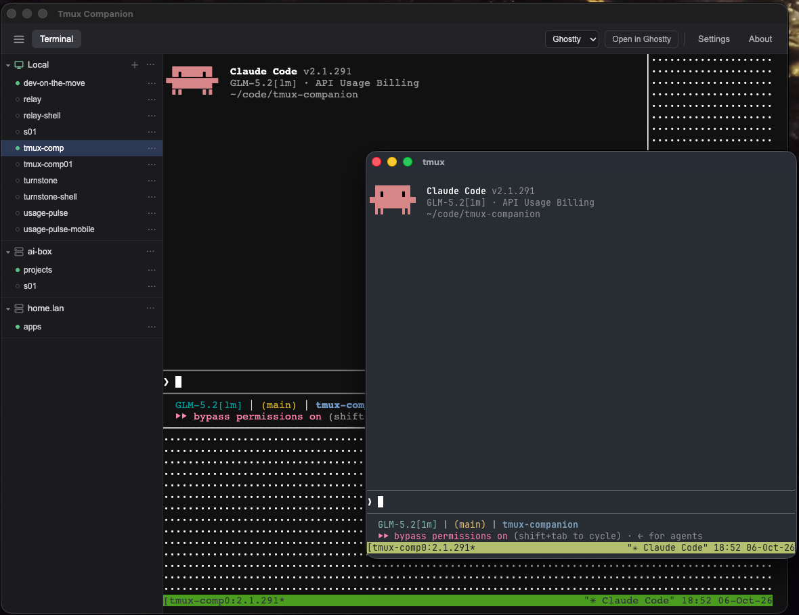

<p align="center">
  
</p>

<h1 align="center">Tmux Companion</h1>

<p align="center">
  
  
  
  
</p>

<p align="center">
  Made by
  <a href="https://beecode.rs"></a>
  <a href="https://beecode.rs"><strong>Beecode</strong></a>
</p>

Tmux Companion is a small Electron + TypeScript desktop app for managing tmux sessions across the local machine and SSH machines. It does five things:

- **Instances & auto-numbered sessions** — each instance is one connection to one machine, with its tmux sessions listed in a sidebar where you can create, clone, rename, kill, and switch them. New sessions are auto-numbered `s01`, `s02`, … (the next free number).
- **Embedded terminal** — an xterm.js terminal backed by node-pty that runs your real shell inside your real tmux. Your `~/.tmux.conf` and shell rc are never touched, ptys keep running while you switch views, and it can optionally import your Ghostty theme to match your standalone terminal.
- **External terminal picker** — launch any session in Ghostty, Terminal.app, iTerm2, or whatever your OS has installed, with user-editable launch templates.
- **SSH instances** — remote machines go through the system `ssh` binary with your keys and `~/.ssh/config` aliases. The app never handles passwords.
- **Works alongside Relay** — sessions created by [Relay](https://github.com/beecode-rs/relay), the mobile SSH app, are listed like any other and never renumbered, so phone and desktop can work the same tmux sessions on the same machines.

## Status: Proof of Concept

Tmux Companion is at **v0.1.0** and still a proof of concept. It was built through rapid AI-assisted iteration ("vibe coding") rather than carefully reviewed engineering, so expect rough edges, missing pieces, and breaking changes without notice. While it remains a POC the version stays on `0.x`; the move out of the POC phase coincides with the major version moving to `1`.

## Screenshots

| [Terminal view](resource/docs/features.md#embedded-terminal) | [Session menu](resource/docs/features.md#instances-and-sessions) | [Instance menu](resource/docs/features.md#instances-and-sessions) |
| :---: | :---: | :---: |
| <a href="resource/screenshots/terminal-view.png"></a> | <a href="resource/screenshots/tmux-session-menu.png"></a> | <a href="resource/screenshots/instance-menu.png"></a> |

| [New instance](resource/docs/features.md#instances-and-sessions) | [External terminal](resource/docs/features.md#external-terminal-launches) |
| :---: | :---: |
| <a href="resource/screenshots/add-new-ssh-instance.png"></a> | <a href="resource/screenshots/open-in-external-terminal.png"></a> |

The titles link to each feature's section in [resource/docs/features.md](resource/docs/features.md).

## Features

- **Auto-numbered sessions** — new sessions get the next free plain number (`s01`, `s02`, …) and never collide with a session another tool already created.
- **Cloning** — duplicate a session into a fresh one that starts in the same working directory as the source.
- **Embedded terminal** — an xterm.js terminal runs your real shell inside your real tmux, without touching `~/.tmux.conf` or your shell rc.
- **Ghostty theme import** — optionally import your Ghostty theme so the embedded terminal matches your standalone terminal.
- **External-terminal launches** — open any session in Ghostty, Terminal.app, iTerm2, or another installed terminal, using user-editable launch templates.
- **SSH hosts** — remote machines connect through the system `ssh` binary with your keys and `~/.ssh/config` aliases; the app never handles passwords.

For a deeper look at each feature — settings, edge cases, and how things work under the hood — see [resource/docs/features.md](resource/docs/features.md).

## Why this exists

I move between a desktop and a phone all day: long-form work happens in tmux on the desktop, then continues from the couch or on the go through Relay on my phone. The missing piece was a desktop sidekick that treats those sessions as first-class citizens — a sidebar of sessions per machine, an embedded terminal that is just my real tmux, and one-click launches into a proper OS terminal — without either app stomping on the other's sessions. Together the two apps form one continuous workspace.

That is why Relay compatibility is a design constraint here, not a feature: every session on a machine is listed — including the ones Relay creates — nothing is renamed or renumbered, and sessions created here are ordinary tmux sessions with no special format, so they wait for you on whichever device you connect from. The naming rules that keep the two apps from colliding are covered in [resource/docs/features.md](resource/docs/features.md).

## Feature status

Done:

- [x] Local and SSH instances with auto-numbered sessions
- [x] Create, clone, rename, kill, and switch sessions from the sidebar
- [x] Embedded terminal with optional Ghostty theme import
- [x] Launching sessions in external terminals with editable templates
- [x] Listing Relay-created sessions without renaming or renumbering them

Planned:

- [ ] **Keep-awake option** — add an option per OS (macOS/Linux/Windows) to prevent the laptop from going into sleep mode when the lid is closed, so long-running tmux sessions stay alive.
  - ⚠️ Disclaimer: used at your own risk — with lid-close sleep disabled, the laptop keeps running while closed, so it may overheat or drain its battery because it will not sleep when the lid is closed.

## Requirements

**To use the app:** a macOS or Linux machine with [tmux](https://github.com/tmux/tmux) installed; remote machines need tmux too — the app drives tmux on every machine it manages.

**To build from source:** [Node.js](https://nodejs.org) and [pnpm](https://pnpm.io).

## Download & install

Downloads live on the [GitHub Releases](https://github.com/beecode-rs/tmux-companion/releases) page.

**macOS** (Apple Silicon & Intel, one universal build): download `Tmux-Companion-<version>-universal.dmg` and drag **Tmux Companion** to Applications.

> The release builds are not signed or notarized with an Apple developer certificate, so macOS blocks the first launch. That is standard macOS behavior for any unsigned app — it needs a one-time confirmation that you trust it:
>
> 1. Open **Tmux Companion** once — it will be blocked with a "cannot be checked for malicious software" dialog. Dismiss the dialog.
> 2. Go to **System Settings → Privacy & Security** and scroll down to the Security section.
> 3. Under "'Tmux Companion' was blocked from use because it is not notarized", click **Open Anyway** and confirm.

Alternatively, clear the quarantine flag from a Terminal:

```bash
xattr -cr '/Applications/Tmux Companion.app'
```

**Ubuntu — AppImage**: make it executable and run it (no install needed):

```bash
chmod +x Tmux-Companion-<version>.AppImage
./Tmux-Companion-<version>.AppImage
```

**Ubuntu — deb package**:

```bash
sudo apt install ./tmux-companion_<version>_amd64.deb
```

### From source

Requires [Node.js](https://nodejs.org) and [pnpm](https://pnpm.io).

```bash
git clone https://github.com/beecode-rs/tmux-companion.git
cd tmux-companion
pnpm run init
pnpm dev
```

The full development setup lives in [resource/docs/development.md](resource/docs/development.md).

## Getting started

1. Open the app — it comes with a **Local** instance for the machine you are on.
2. Create a session from the instance's **New session** action; it gets the next free number (`s01`, `s02`, …) and you work with it in the embedded terminal.
3. To reach a remote machine, add an SSH instance — label, host, user, port, and an optional identity file — and connect.
4. Clone, rename, kill, or switch sessions from the session menu, and open any session in an external terminal when you want a full OS terminal.

## Privacy & security

**Your SSH connection details and key paths, and the token that guards the app's internal channel,** stay on your device, stored in the app's own settings file, and are sent only to your own machine and the machines you connect to. The app contains no analytics and no telemetry.

The app never sees your passwords — SSH runs through the system `ssh` tool with your own keys and config. Details: [resource/docs/security.md](resource/docs/security.md).

## Support & contributing

Found a bug or have an idea? Open an issue on [GitHub](https://github.com/beecode-rs/tmux-companion/issues) — include the app version, your OS, and the steps to reproduce. Pull requests are welcome too; keep the [feature status](#feature-status) in mind, and open an issue before starting something large.

## For developers

The README covers using the app. To work on it:

- [Development setup](resource/docs/development.md) — prerequisites, daily commands, quality gates
- [Architecture](resource/docs/architecture.md) — how the source is layered
- [Security internals](resource/docs/security.md) — how SSH and the local API are locked down

## License

[MIT](LICENSE)
